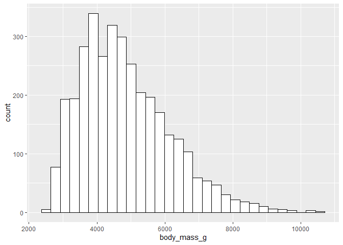
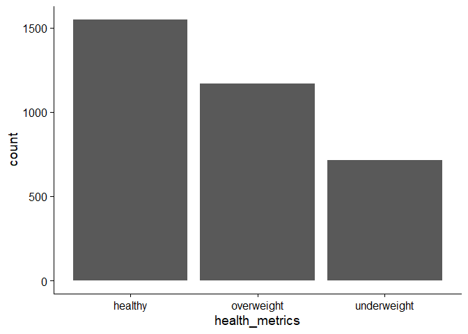
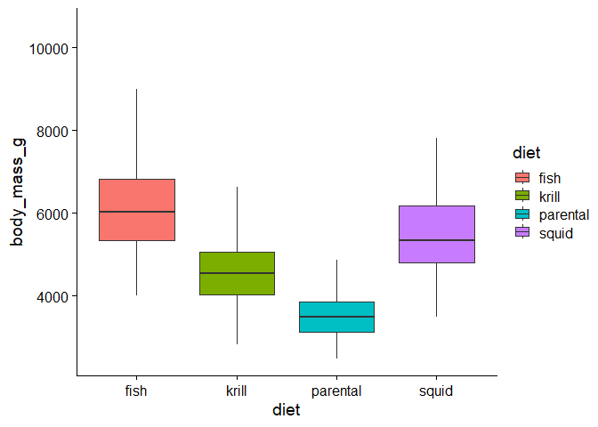
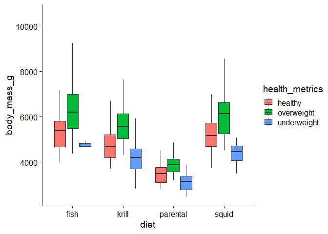
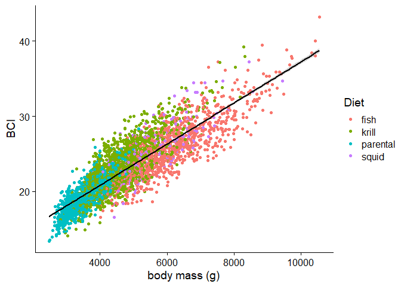
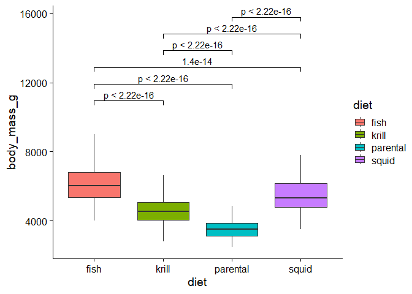

Group 4 Project 1
================
2024-10-08

## Target Audience

Our target audience are students in Biology 204. Some experiences with R
but not advanced level. No experiences with markdown

## Instructions and Accessing R Tutorial

Have RStudio downloaded and make sure it is updated to the latest
version Open GitHub on your web browser and access the Bucknell-Biol 364
Repository Search for Project_1_Group_4_2024, click the green code
button on the top right of the repo, and click “download zip” to load
the documents into your folder- move these files into a folder you can
easily access Open R Studio again and find these documents using the
files tab in the bottom right corner of R Click on Project01.Rmd to load
the tutorial!

## Objectives

Learn how to properly use code chunks, make comments, and properly
format an RMD file - Cassie Generating data frames from imported data,
understanding different variable and data types in R - Thomas Organizing
and mutating/manipulating dataframes, removing outliers and N/A values
Hedy Assessing normality and determining which statistical tests to use-
Cassie Generating visually appealing graphs Hedy Combining figures with
their respective statistical tests - Thomas

## Hypothesis/examples

The diet of penguins influences their mass Penguins of the same species
will have different mean body masses based on their location The age of
the penguin will affect it’s primary diet - will need to filter out
chicks as they have a parental diet The island the penguins are located
on affects the health condition of the penguins

dHHHHHHHHHHHHHHHHHHHHHHHHHHHHHHHHHHb
HHP%%#%%%%%%%%%%%%%%%%#%%%%%%%#%%VHH
HH%%%%%%%%%%#%v\~\~\~\~\~~%%%#%%%%%%%%HH HH%%%%%#%%%%v’ \~\~\~~%%%%%#%HH
HH%%#%%%%%%v’dHHb a%%%#%%%%%%HH HH%%%%%#%%v’dHHHA :%%%%%%#%%%%HH
HH%%%#%%%v’ VHHHHaadHHb:%#%%%%%%%%HH HH%%%%%#v’
`VHHHHHHHHb:%%%%%#%%%HH HH%#%%%v'`VHHHHHHH:%%%#%%#%%HH HH%%%%%’
dHHHHHHH:%%#%%%%%%HH HH%%#%% dHHHHHHHH:%%%%%%#%%HH HH%%%%%
dHHHHHHHHH:%%#%%%%%%HH HH#%%%% VHHHHHHHHH:%%%%%#%%%HH HH%%%%# b
HHHHHHHHV:%%%#%%%%#HH HH%%%%% Hb HHHHHHHV’%%%%%%%%%%HH HH%%#%% HH
dHHHHHHV’%%%#%%%%%%%HH HH%#%%% VHbdHHHHHHV’#%%%%%%%%#%%HH HHb%%#%
VHHHHHHHV’%%%%%#%%#%%%%HH HHHHHHHb VHHHHHHH:%odHHHHHHbo%dHH
HHHHHHHHboodboooooodHHHHHHHHHHHHHHHH
HHHHHHHHHHHHHHHHHHHHHHHHHHHHHHHHHHHH
VHHHHHHHHHHHHHHHHHHHHHHHHHHHHHHHHHHV

``` r
# Load other packages here.
if (!require("cowplot")) install.packages("cowplot"); library(cowplot)
```

    ## Loading required package: cowplot

``` r
if (!require("conflicted")) install.packages("conflicted"); library(conflicted) # For dealing with conflicts
```

    ## Loading required package: conflicted

``` r
if (!require("tidyverse")) install.packages("tidyverse"); library(tidyverse) # For everything
```

    ## Loading required package: tidyverse

    ## ── Attaching core tidyverse packages ──────────────────────── tidyverse 2.0.0 ──
    ## ✔ dplyr     1.1.4     ✔ readr     2.1.5
    ## ✔ forcats   1.0.0     ✔ stringr   1.5.1
    ## ✔ ggplot2   3.5.1     ✔ tibble    3.2.1
    ## ✔ lubridate 1.9.3     ✔ tidyr     1.3.1
    ## ✔ purrr     1.0.2

``` r
if (!require("rstatix")) install.packages("rstatix"); library(rstatix) 
```

    ## Loading required package: rstatix

``` r
conflict_prefer_all("dplyr", quiet = TRUE)
```

## Penguin analysis R tutorial

Throughout this tutorial, we will introduce some of the basic properties
and functions of R, as well as some additional packages which can be
used to enhance it’s functionality. In order to show these tools, we
will be using the classic Palmer Penguins dataset, and exploring the
relationships between many of the variables it includes.

## Objective 1: Using code chunks

In an RMD file, code chunks are blocks of code that read commands. This
is indicated by the green button with a plus sign in the upper right
corner of the console. Code chunks will always begin with a title and
three back ticks and end with back ticks. The code chunk will not run
properly if this is not indicated correctly.  
To run a code chunk, hit the third symbol, signified by a green arrow in
the top right corner of the single chunk. To run every previous code
chunk, hit second button in the top right corner of the code chunk, this
is indicated by a downwards arrow.

``` r
#You can do math using code chunks
2+8
```

    ## [1] 10

As I have done previously, you can make comments all throughout an RMD
file by beginning your statements with a hashtag (#) This prevents R
from reading it as code, and instead as text.

``` r
#Make sure you have the dataset file downloaded and can be easily accessed in your working directory before trying to run the code!
penguins <- read.csv("palmerpenguins_extended.csv")
```

Success! After hitting the green arrow for the particular code chunk,
you can always check in the console below if you have properly read in
the file. If not, make sure you downloaded the dataset and that it is in
your working directory.

## Objective 2: Understanding our data

Now that we have imported our data into R, it’s important to check that
everything is what we expect it to be. The CSV file that we imported has
now taken the form of a dataframe in our R environment, similar to an
Excel file. However, in R, each of the columns will be treated as a
variable. Based on the characteristics of the data in each column, R
will treat it as a certain type of variable. Using the str(penguins)
function, we can get a brief summary of how R is interpreting this data.

``` r
str(penguins)
```

    ## 'data.frame':    3430 obs. of  11 variables:
    ##  $ species          : chr  "Adelie" "Adelie" "Adelie" "Adelie" ...
    ##  $ island           : chr  "Biscoe" "Biscoe" "Biscoe" "Biscoe" ...
    ##  $ bill_length_mm   : num  53.4 49.3 55.7 38 60.7 35.7 61 66.1 61.4 54.9 ...
    ##  $ bill_depth_mm    : num  17.8 18.1 16.6 15.6 17.9 16.8 20.8 20.8 19.9 22.3 ...
    ##  $ flipper_length_mm: num  219 245 226 221 177 194 211 246 270 230 ...
    ##  $ body_mass_g      : num  5687 6811 5388 6262 4811 ...
    ##  $ sex              : chr  "female" "female" "female" "female" ...
    ##  $ diet             : chr  "fish" "fish" "fish" "fish" ...
    ##  $ life_stage       : chr  "adult" "adult" "adult" "adult" ...
    ##  $ health_metrics   : chr  "overweight" "overweight" "overweight" "overweight" ...
    ##  $ year             : int  2021 2021 2021 2021 2021 2021 2021 2021 2021 2021 ...

Based on the output of this command, we can see that R is interpreting
variables like bill length, bill depth, flipper length, and body mass as
numeric values. However, some values, such as species, sex, and island
are being treated as characters. This means that R is treating them as
strings of text, rather than as categories. Since our analysis requires
these columns to be used as groups rather than individual strings, we
need to tell R that these are categorical values, or factors. In this
case, the variables species, island, sec, diet, life stage, and health
metrics are all categories, rather than unique observations for each
individual.

``` r
penguins$species <- as.factor(penguins$species)
penguins$island <- as.factor(penguins$island)
penguins$sex <- as.factor(penguins$sex)
penguins$diet <- as.factor(penguins$diet)
penguins$life_stage <- as.factor(penguins$life_stage)
penguins$health_metrics <- as.factor(penguins$health_metrics)
```

Now that we’ve told R how to treat these variables, we should make sure
that everything is as we expect. We can use the str() function once
again to see if R is interpreting our dataframe as intended.

``` r
str(penguins)
```

    ## 'data.frame':    3430 obs. of  11 variables:
    ##  $ species          : Factor w/ 3 levels "Adelie","Chinstrap",..: 1 1 1 1 1 1 1 1 1 1 ...
    ##  $ island           : Factor w/ 3 levels "Biscoe","Dream",..: 1 1 1 1 1 1 1 1 1 1 ...
    ##  $ bill_length_mm   : num  53.4 49.3 55.7 38 60.7 35.7 61 66.1 61.4 54.9 ...
    ##  $ bill_depth_mm    : num  17.8 18.1 16.6 15.6 17.9 16.8 20.8 20.8 19.9 22.3 ...
    ##  $ flipper_length_mm: num  219 245 226 221 177 194 211 246 270 230 ...
    ##  $ body_mass_g      : num  5687 6811 5388 6262 4811 ...
    ##  $ sex              : Factor w/ 2 levels "female","male": 1 1 1 1 1 1 1 2 2 2 ...
    ##  $ diet             : Factor w/ 4 levels "fish","krill",..: 1 1 1 1 1 1 1 1 1 1 ...
    ##  $ life_stage       : Factor w/ 3 levels "adult","chick",..: 1 1 1 1 3 3 1 1 1 1 ...
    ##  $ health_metrics   : Factor w/ 3 levels "healthy","overweight",..: 2 2 2 2 2 2 2 2 2 2 ...
    ##  $ year             : int  2021 2021 2021 2021 2021 2021 2021 2021 2021 2021 ...

Now we can see that our data is being interpreted correctly by R. Before
we run any analysis of this data, it’s important to check that the
dataset we’re using is complete. If there are any N/A values present,
they might cause an issue. The is.na() command will tell us if any
missing values are present.

``` r
is.na(penguins)
```

Wow! This command left us with a lot to interpret, as it was simply
checking each value in the dataframe. With more than 3000 observations,
this isn’t appropriate for our dataset. However, we can use the
summary() command to give us a glimpse at each of our columns, which
will let us know if anything is missing.

``` r
summary(penguins)
```

    ##       species           island     bill_length_mm  bill_depth_mm  
    ##  Adelie   :1560   Biscoe   :1785   Min.   :13.60   Min.   : 9.10  
    ##  Chinstrap: 623   Dream    :1133   1st Qu.:28.90   1st Qu.:16.60  
    ##  Gentoo   :1247   Torgensen: 512   Median :34.50   Median :18.40  
    ##                                    Mean   :38.53   Mean   :18.45  
    ##                                    3rd Qu.:46.60   3rd Qu.:20.30  
    ##                                    Max.   :88.20   Max.   :27.90  
    ##  flipper_length_mm  body_mass_g        sex             diet     
    ##  Min.   :140       Min.   : 2477   female:1726   fish    : 958  
    ##  1st Qu.:185       1st Qu.: 3844   male  :1704   krill   :1419  
    ##  Median :203       Median : 4634                 parental: 860  
    ##  Mean   :207       Mean   : 4835                 squid   : 193  
    ##  3rd Qu.:226       3rd Qu.: 5622                                
    ##  Max.   :308       Max.   :10549                                
    ##     life_stage       health_metrics      year     
    ##  adult   :1029   healthy    :1550   Min.   :2021  
    ##  chick   : 860   overweight :1167   1st Qu.:2022  
    ##  juvenile:1541   underweight: 713   Median :2024  
    ##                                     Mean   :2023  
    ##                                     3rd Qu.:2024  
    ##                                     Max.   :2025

Based on this summary, it seems that we luckily aren’t missing any
observations. We can now move on to our analysis.

## Objective 3: Manipulating our data

During data exploration, particularly with complex datasets, it is often
necessary to manipulate the DataFrame. This may involve removing columns
that do not provide significant information or grouping specific data of
interest to facilitate a more efficient data analysis process. In order
to do this we will show some functions which are part of tidyverse
package.

The group_by function is utilized to examine the relationships among
specific columns in a dataset. In this case, we aim to investigate the
relationship between island location, dietary sources, and body mass.
Our hypothesis posits that the geographical location of an island may
influence the dietary habits of the animals, subsequently impacting
their body mass. However, before diving into the group function it is
important to talk about one one the singnificant R functions which is
pipeline operator \|\> The pipe operator takes the output of one
expression and passes it as the first argument to the next expression.
This makes it easier to read and understand the flow of data
transformations. • Readability: The code reads more like a sequence of
operations, making it easier to follow. • Less Nesting: It reduces the
need for nested function calls, which can be hard to read. • Debugging:
You can easily inspect the output at each step if needed, making
debugging simpler.

``` r
penguins |> 
  group_by(island, diet, body_mass_g) |>
  summarize(meanMass=mean(body_mass_g, na.rm = TRUE))
```

    ## `summarise()` has grouped output by 'island', 'diet'. You can override using
    ## the `.groups` argument.

    ## # A tibble: 3,179 × 4
    ## # Groups:   island, diet [12]
    ##    island diet  body_mass_g meanMass
    ##    <fct>  <fct>       <dbl>    <dbl>
    ##  1 Biscoe fish         4013     4013
    ##  2 Biscoe fish         4020     4020
    ##  3 Biscoe fish         4197     4197
    ##  4 Biscoe fish         4218     4218
    ##  5 Biscoe fish         4228     4228
    ##  6 Biscoe fish         4323     4323
    ##  7 Biscoe fish         4327     4327
    ##  8 Biscoe fish         4356     4356
    ##  9 Biscoe fish         4366     4366
    ## 10 Biscoe fish         4386     4386
    ## # ℹ 3,169 more rows

By running the code chunk above we can see that interpretation of the
data became much easier.

Next, we will incorporate an additional column into our dataset. For
example, to assess the Body Condition Index (BCI), we should divide the
total body mass by the lengths of the body parts. To do so we need to
use mutate function which again is one part of tidyverse package.

``` r
penguins <- mutate(penguins, BCI = body_mass_g / flipper_length_mm)
summary(penguins$BCI)
```

    ##    Min. 1st Qu.  Median    Mean 3rd Qu.    Max. 
    ##   13.39   20.14   22.69   23.12   25.78   43.23

By running the code chunk above we can see that we added an extra column
to our existed data set named BCI.

Next, when want to make subsets of rows from a data frame we can use
filter function. This allows us to make another dataset which make the
data interpretation easier. Here by running the code chunk we can see
that we made another data set called palmerpenguins_extended.filter
which has 2826 observations with 12 variables and we can see there 2826
observations for penguins under 6038 g.

``` r
penguins.filter <- filter(penguins, body_mass_g < 6038)
dim(penguins.filter)
```

    ## [1] 2826   12

dim() function is used to retrieve or set the dimensions of an object,
such as a matrix or an array. It returns a vector containing the size of
each dimension of the object. • Works with matrices, arrays, and data
frames. • For data frames, dim() will return the number of rows and
columns. • It’s useful for understanding the structure of your data in
R.

## Objective 4: Assessing normality and determining what statistical test to use

Depending on what data you are working with and what you want to find,
you can use various kinds of statistical tests within your RMD file.
T-Tests are great for comparing the mean of the data. There are multiple
kinds of t-tests you can conduct, depending on what you want to compare
the mean with.

``` r
#For this example, we will be comparing the average body mass of male and female penguins, therefore our variables will be body mass and sex. 
t.test(body_mass_g ~ sex, data = penguins)
```

    ## 
    ##  Welch Two Sample t-test
    ## 
    ## data:  body_mass_g by sex
    ## t = -20.888, df = 3262.5, p-value < 2.2e-16
    ## alternative hypothesis: true difference in means between group female and group male is not equal to 0
    ## 95 percent confidence interval:
    ##  -964.8544 -799.2632
    ## sample estimates:
    ## mean in group female   mean in group male 
    ##             4396.510             5278.569

These tests can output useful information, such as a p-value, which can
tell you if there is a significant difference.

Another statistical test are ANOVA, which measures the variance for
multiple groups.

``` r
#Here, we can test for the effect of species and sex on body mass in penguins
aov(body_mass_g ~ species * sex, data = penguins)
```

    ## Call:
    ##    aov(formula = body_mass_g ~ species * sex, data = penguins)
    ## 
    ## Terms:
    ##                    species        sex species:sex  Residuals
    ## Sum of Squares   723245578  624262641    13448480 4533358588
    ## Deg. of Freedom          2          1           2       3424
    ## 
    ## Residual standard error: 1150.65
    ## Estimated effects may be unbalanced

Linear regression models are also great statistical tests for estimating
the linear relationship between one or more explanatory variables.

``` r
multiple_lm <- lm(body_mass_g ~ flipper_length_mm + bill_length_mm, data = penguins)
summary(multiple_lm)
```

    ## 
    ## Call:
    ## lm(formula = body_mass_g ~ flipper_length_mm + bill_length_mm, 
    ##     data = penguins)
    ## 
    ## Residuals:
    ##     Min      1Q  Median      3Q     Max 
    ## -2316.1  -523.2   -54.8   481.3  3971.6 
    ## 
    ## Coefficients:
    ##                     Estimate Std. Error t value Pr(>|t|)    
    ## (Intercept)       -2014.7264   100.0151  -20.14   <2e-16 ***
    ## flipper_length_mm    28.6871     0.6082   47.16   <2e-16 ***
    ## bill_length_mm       23.6279     1.3362   17.68   <2e-16 ***
    ## ---
    ## Signif. codes:  0 '***' 0.001 '**' 0.01 '*' 0.05 '.' 0.1 ' ' 1
    ## 
    ## Residual standard error: 766.2 on 3427 degrees of freedom
    ## Multiple R-squared:  0.6587, Adjusted R-squared:  0.6585 
    ## F-statistic:  3307 on 2 and 3427 DF,  p-value: < 2.2e-16

The output from this lm displays the estimate coefficients for flipper
and bill length, as well as their p-values. This information can be
really helpful for how different variables can determine body mass.

## Objective 5: Graphing

Analytical graphics play a vital role in data analysis, making it
essential to select the appropriate method for visualizing our data.
making histograms with the data that you want to explore is one of the
easiest way to visualize your data and to see if the data has the normal
distribution. By looking at our code chunk we can see that we used the
color, fill, and bins commands to make our histogram better and easier
to interpret the data.

``` r
ggplot(penguins) +
  aes(x=body_mass_g) +
  geom_histogram(color = "black", fill = "white", bins = 30)
```

<!-- -->

ggplot is a powerful tool in R to make more sophisticated graphs. Here
we will break down this function to details to make it more clear.

Fist we should start by choosing the data frame and the variable that we
want to visualize

Aesthetics (aes): Defines how data variables map to visual properties
(e.g., x and y axes, colors, shapes). For example: aes(x = variable1, y
= variable2)

geom\_ functions define the type of plot (e.g., points, lines, bars) and
common geoms include: geom_point(): scatter plots geom_line(): line
graphs geom_bar(): bar charts geom_histogram(): histograms (which we saw
in the code chunk above)

Facets function splits data into subplots based on a factor which
includes facet_wrap(~ variable) or facet_grid(rows ~ columns).

Finally, to make our plots more presentable we can use different themes
to customize the appearance of the plot such as: Theme\_ cowplot(),
theme_minimal(), theme_classic(),

Here lets see these functions step by step.

``` r
ggplot(penguins) +
  aes(x = health_metrics) +
  geom_bar() +
  theme_cowplot()
```

<!-- -->

Running the code chunk above allows us to compare the number of
individuals based on their health metrics.

Now lets make our plot more professional. If we wand to see the
relationship between diet and body mass we can make a box plot as it is
shown below. we can use fill function to add color to our plot and
differentiate among our variables also we can chose to remove the
outliers by using this command (outlier.shape = NA) We can see that our
graph is much more presentable.

``` r
ggplot(penguins) +
  aes(x = diet, y = body_mass_g, fill = diet) +
  geom_boxplot(outlier.shape = NA) +
  theme_cowplot()
```

<!-- -->

Also, we can add another variable to the graph. For example, here I
wanted to see how the health metrics looks like in each dietary
categories and how they can contribute to body mass. So, for the fill
function I chose health_metrics

``` r
ggplot(penguins) +
  aes(x = diet, y = body_mass_g, fill = health_metrics) +
  geom_boxplot(outlier.shape = NA) +
  theme_cowplot()
```

<!-- -->

Finally, we can also make a line graph which allows us to visualize and
interpret the relationship among three variables: body mass, BCI, and
diet. Here, we can see that labs function allows us to change the label
of the graph and we can name each variable as we want them to be.

``` r
ggplot(penguins) +
  aes(x = body_mass_g, y = BCI) +
  geom_point(aes(color = factor(diet))) +
  geom_smooth(method=lm , color="black", se=TRUE) +
  theme_cowplot() +
  labs(color="Diet") +
  xlab("body mass (g)") + 
  ylab("BCI")
```

    ## `geom_smooth()` using formula = 'y ~ x'

<!-- -->

## Objective 6: Combining stats and graphs

Now that we have some statistical analysis of our data, as well as some
figures to better visualize it, the next step is to combine the two to
allow for an easy interpretation. Using the package ggpubr, we can
combine our statistical tests with our graphs to create some
publication-quality figures.

In order to accomplish this, we can use the package ggpubr. This package
allows for us to complete both the functions of ggplot and our
statistical analysis within the same section of code. The syntax in this
package starts out the same as ggplot as shown previously, but we can
add the function “stat_compare_means” to add the results of a
statistical test and it’s significance on to the chart. In the argument
of this function, we have to specify the comparisons we want to provide
the statistical tests for using the “comparisons” argument. We then have
to specify which statistical method we want to use, using the “methods”
argument, as well as how we want the results to be displayed, using the
argument “label”. Here is an an example showing the graph of the mass of
penguins versus their diet categories.

``` r
if (!require("ggpubr")) install.packages("ggpubr"); library(ggpubr)
```

    ## Loading required package: ggpubr

``` r
ggplot(penguins) +
  aes(x = diet, y = body_mass_g, fill = diet) +
  geom_boxplot(outlier.shape = NA) +
  stat_compare_means(comparisons = list(
      c("fish", "krill"), 
      c("fish", "parental"), 
      c("fish", "squid"),
      c("krill", "parental"), 
      c("krill", "squid"), 
      c("parental", "squid")),
      method = "t.test",
      label = "p.format") +  
  theme_cowplot()
```

<!-- -->
