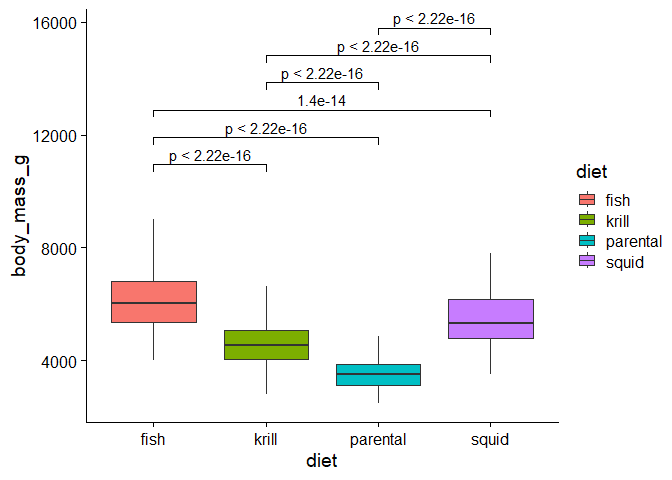
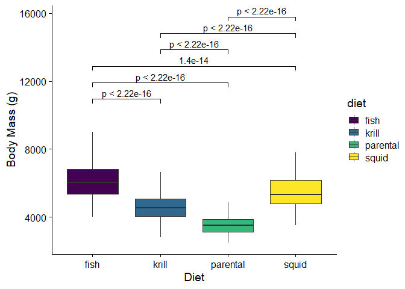
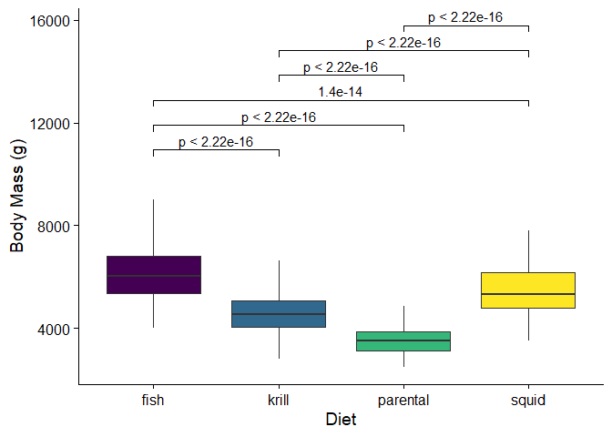
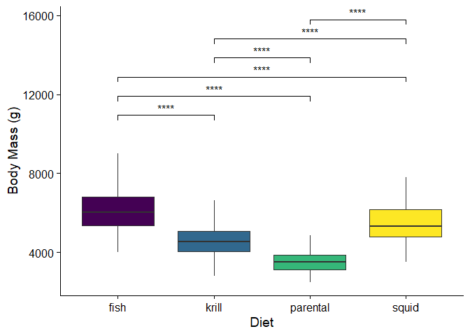
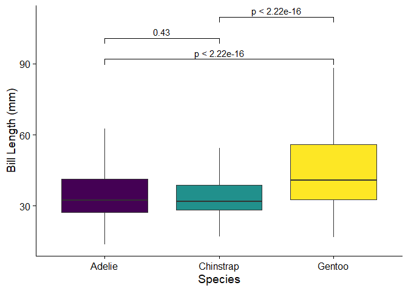

Thomas_section
================
2024-09-19

``` r
penguins <- read.csv("palmerpenguins_extended.csv")
```

Now that we have imported our data into R, it’s important to check that
everything is what we expect it to be. The CSV file that we imported has
now taken the form of a dataframe in our R environment, similar to an
Excel file. However, in R, each of the columns will be treated as a
variable. Based on the characteristics of the data in each column, R
will treat it as a certain type of variable. Using the str(penguins)
function, we can get a brief summary of how R is interpreting this data.

``` r
str(penguins)
```

    ## 'data.frame':    3430 obs. of  11 variables:
    ##  $ species          : chr  "Adelie" "Adelie" "Adelie" "Adelie" ...
    ##  $ island           : chr  "Biscoe" "Biscoe" "Biscoe" "Biscoe" ...
    ##  $ bill_length_mm   : num  53.4 49.3 55.7 38 60.7 35.7 61 66.1 61.4 54.9 ...
    ##  $ bill_depth_mm    : num  17.8 18.1 16.6 15.6 17.9 16.8 20.8 20.8 19.9 22.3 ...
    ##  $ flipper_length_mm: num  219 245 226 221 177 194 211 246 270 230 ...
    ##  $ body_mass_g      : num  5687 6811 5388 6262 4811 ...
    ##  $ sex              : chr  "female" "female" "female" "female" ...
    ##  $ diet             : chr  "fish" "fish" "fish" "fish" ...
    ##  $ life_stage       : chr  "adult" "adult" "adult" "adult" ...
    ##  $ health_metrics   : chr  "overweight" "overweight" "overweight" "overweight" ...
    ##  $ year             : int  2021 2021 2021 2021 2021 2021 2021 2021 2021 2021 ...

Based on the output of this command, we can see that R is interpreting
variables like bill length, bill depth, flipper length, and body mass as
numeric values. However, some values, such as species, sex, and island
are being treated as characters. This means that R is treating them as
strings of text, rather than as categories. Since our analysis requires
these columns to be used as groups rather than individual strings, we
need to tell R that these are categorical values, or factors. In this
case, the variables species, island, sec, diet, life stage, and health
metrics are all categories, rather than unique observations for each
individual.

``` r
penguins$species <- as.factor(penguins$species)
penguins$island <- as.factor(penguins$island)
penguins$sex <- as.factor(penguins$sex)
penguins$diet <- as.factor(penguins$diet)
penguins$life_stage <- as.factor(penguins$life_stage)
penguins$health_metrics <- as.factor(penguins$health_metrics)
```

Now that we’ve told R how to treat these variables, we should make sure
that everything is as we expect. We can use the str() function once
again to see if R is interpreting our dataframe as intended.

``` r
str(penguins)
```

    ## 'data.frame':    3430 obs. of  11 variables:
    ##  $ species          : Factor w/ 3 levels "Adelie","Chinstrap",..: 1 1 1 1 1 1 1 1 1 1 ...
    ##  $ island           : Factor w/ 3 levels "Biscoe","Dream",..: 1 1 1 1 1 1 1 1 1 1 ...
    ##  $ bill_length_mm   : num  53.4 49.3 55.7 38 60.7 35.7 61 66.1 61.4 54.9 ...
    ##  $ bill_depth_mm    : num  17.8 18.1 16.6 15.6 17.9 16.8 20.8 20.8 19.9 22.3 ...
    ##  $ flipper_length_mm: num  219 245 226 221 177 194 211 246 270 230 ...
    ##  $ body_mass_g      : num  5687 6811 5388 6262 4811 ...
    ##  $ sex              : Factor w/ 2 levels "female","male": 1 1 1 1 1 1 1 2 2 2 ...
    ##  $ diet             : Factor w/ 4 levels "fish","krill",..: 1 1 1 1 1 1 1 1 1 1 ...
    ##  $ life_stage       : Factor w/ 3 levels "adult","chick",..: 1 1 1 1 3 3 1 1 1 1 ...
    ##  $ health_metrics   : Factor w/ 3 levels "healthy","overweight",..: 2 2 2 2 2 2 2 2 2 2 ...
    ##  $ year             : int  2021 2021 2021 2021 2021 2021 2021 2021 2021 2021 ...

Now we can see that our data is being interpreted correctly by R. Before
we run any analysis of this data, it’s important to check that the
dataset we’re using is complete. If there are any N/A values present,
they might cause an issue. The is.na() command will tell us if any
missing values are present.

``` r
is.na(penguins)
```

Wow! This command left us with a lot to interpret, as it was simply
checking each value in the dataframe. With more than 3000 observations,
this isn’t appropriate for our dataset. However, we can use the
summary() command to give us a glimpse at each of our columns, which
will let us know if anything is missing.

``` r
summary(penguins)
```

    ##       species           island     bill_length_mm  bill_depth_mm  
    ##  Adelie   :1560   Biscoe   :1785   Min.   :13.60   Min.   : 9.10  
    ##  Chinstrap: 623   Dream    :1133   1st Qu.:28.90   1st Qu.:16.60  
    ##  Gentoo   :1247   Torgensen: 512   Median :34.50   Median :18.40  
    ##                                    Mean   :38.53   Mean   :18.45  
    ##                                    3rd Qu.:46.60   3rd Qu.:20.30  
    ##                                    Max.   :88.20   Max.   :27.90  
    ##  flipper_length_mm  body_mass_g        sex             diet     
    ##  Min.   :140       Min.   : 2477   female:1726   fish    : 958  
    ##  1st Qu.:185       1st Qu.: 3844   male  :1704   krill   :1419  
    ##  Median :203       Median : 4634                 parental: 860  
    ##  Mean   :207       Mean   : 4835                 squid   : 193  
    ##  3rd Qu.:226       3rd Qu.: 5622                                
    ##  Max.   :308       Max.   :10549                                
    ##     life_stage       health_metrics      year     
    ##  adult   :1029   healthy    :1550   Min.   :2021  
    ##  chick   : 860   overweight :1167   1st Qu.:2022  
    ##  juvenile:1541   underweight: 713   Median :2024  
    ##                                     Mean   :2023  
    ##                                     3rd Qu.:2024  
    ##                                     Max.   :2025

Based on this summary, it seems that we luckily aren’t missing any
observations. We can now move on to our analysis.

Now that we have some statistical analysis of our data, as well as some
figures to better visualize it, the next step is to combine the two to
allow for an easy interpretation. Using the package ggpubr, we can
combine our statistical tests with our graphs to create some
publication-quality figures.

In order to accomplish this, we can use the package ggpubr. This package
allows for us to complete both the functions of ggplot and our
statistical analysis within the same section of code. The syntax in this
package starts out the same as ggplot as shown previously, but we can
add the function “stat_compare_means” to add the results of a
statistical test and it’s significance on to the chart. In the argument
of this function, we have to specify the comparisons we want to provide
the statistical tests for using the “comparisons” argument. We then have
to specify which statistical method we want to use, using the “methods”
argument, as well as how we want the results to be displayed, using the
argument “label”. Here is an an example showing the graph of the mass of
penguins versus their diet categories.

``` r
if (!require("ggpubr")) install.packages("ggpubr"); library(ggpubr)
```

    ## Loading required package: ggpubr

``` r
ggplot(penguins) +
  aes(x = diet, y = body_mass_g, fill = diet) +
  geom_boxplot(outlier.shape = NA) +
  stat_compare_means(comparisons = list(
      c("fish", "krill"), 
      c("fish", "parental"), 
      c("fish", "squid"),
      c("krill", "parental"), 
      c("krill", "squid"), 
      c("parental", "squid")),
      method = "t.test",
      label = "p.format") +  
  theme_cowplot()
```

<!-- -->

This figure displays the p-values between each of our dietary groups,
and it seems like there’s a significant difference in weight for each of
them! We can tidy this figure up a bit more by changing the labels.
Additionally, using the viridis package, we can make the colors used in
this figure more appropriate in cases of colorblindness, or if it needs
to be printed in black and white.

``` r
if (!require("viridis")) install.packages("viridis"); library(viridis)

ggplot(penguins) +
  aes(x = diet, y = body_mass_g, fill = diet) +
  geom_boxplot(outlier.shape = NA) +
  stat_compare_means(comparisons = list(
      c("fish", "krill"), 
      c("fish", "parental"), 
      c("fish", "squid"),
      c("krill", "parental"), 
      c("krill", "squid"), 
      c("parental", "squid")),
      method = "t.test",
      label = "p.format") +  
  theme_cowplot() + 
  xlab("Diet") + 
  ylab("Body Mass (g)") + 
  scale_fill_viridis_d("diet")
```

<!-- --> This
figure looks good, but the addition of a legend takes up a lot of space,
and doesn’t really provide any additional information. As a final
modification, we can remove it and generate our final figure.

``` r
ggplot(penguins) +
  aes(x = diet, y = body_mass_g, fill = diet) +
  geom_boxplot(outlier.shape = NA) +
  stat_compare_means(comparisons = list(
      c("fish", "krill"), 
      c("fish", "parental"), 
      c("fish", "squid"),
      c("krill", "parental"), 
      c("krill", "squid"), 
      c("parental", "squid")),
      method = "t.test",
      label = "p.format") +  
  theme_cowplot() + 
  xlab("Diet") + 
  ylab("Body Mass (g)") + 
  scale_fill_viridis_d("diet") +
theme(legend.position = "none")  
```

<!-- -->

Now, we have a visually appealing and easy to read figure that
summarizes the relationship between the body mass of the penguins
sampled and their respective diets, as well as the statistical
significance of the differences between each of these categories.
However, displaying these numbers in scientific notation gives us quite
a bit of chart junk. Luckily, this package allows us to simplify, by
specifying that labels should only be added when p values are
significant, changing the labels argument from “label = ‘p.format’” to
“label = ‘p.signif’”. This allows us to display our p values using the
standard notation of asterisks, rather than displaying the entire value
on our chart.

``` r
ggplot(penguins) +
  aes(x = diet, y = body_mass_g, fill = diet) +
  geom_boxplot(outlier.shape = NA) +
  stat_compare_means(comparisons = list(
      c("fish", "krill"), 
      c("fish", "parental"), 
      c("fish", "squid"),
      c("krill", "parental"), 
      c("krill", "squid"), 
      c("parental", "squid")),
      method = "t.test",
      label = "p.signif") +  
  theme_cowplot() + 
  xlab("Diet") + 
  ylab("Body Mass (g)") + 
  scale_fill_viridis_d("diet") +
theme(legend.position = "none")  
```

<!-- -->

This example should outline the syntax and format used to create
high-quality figures. Using the examples we’ve provided so far in the
tutorial, can you create a figure that compares groups and displays the
statistical significance of the comparison? Some interesting comparisons
to consider may be the island penguins are found on versus their mass,
or investigating the difference between properties such as bill and
flipper measurements between species. The following code should provide
a skeleton, where you can replace the sections with three question marks
(???) with the variables you are interested in examining. The formatting
for this figure has been excluded, to allow you to play with different
label and theme options. An example that shows this skeleton code filled
in will follow the acknowledgements.

``` r
ggplot(penguins) +
  aes(x = ???, y = ???, fill = ???) +
  geom_boxplot(outlier.shape = NA) +
  stat_compare_means(comparisons = list(
      c("???", "???"), 
      c("???", "???"), 
      c("???", "???")), method = "???", label = "???") 
```

### Example figure for final exercise

``` r
ggplot(penguins) +
  aes(x = species, y = bill_length_mm, fill = species) +
  geom_boxplot(outlier.shape = NA) +
  stat_compare_means(comparisons = list(
      c("Adelie", "Gentoo"), 
      c("Adelie", "Chinstrap"), 
      c("Gentoo", "Chinstrap")), method = "t.test", label = "p.format") +
  theme_cowplot() + 
  xlab("Species") + 
  ylab("Bill Length (mm)") + 
  scale_fill_viridis_d("species") +
theme(legend.position = "none")  
```

<!-- -->

### Random notes etc.

Note that you have to use the “scale_color_viridis_d(”“) command if you
want to use viridis with discrete variables, and plots like histograms
require the scale_fill_viridis(”“) command instead. Color scheme options
are”magma” (or “A”) “inferno” (or “B”) “plasma” (or “C”) “viridis” (or
“D”) “cividis” (or “E”) “rocket” (or “F”) “mako” (or “G”) and “turbo”
(or “h”). We should decide on a consistent one together.

``` r
install.packages("viridis")
```

    ## Warning: package 'viridis' is in use and will not be installed

``` r
library(viridis)


ggplot(penguins) +
  aes(x = bill_length_mm, y = bill_depth_mm, color = body_mass_g) +
  geom_point() + 
  scale_color_viridis("body_mass_g", option="viridis") +
  theme_classic()
```

<!-- -->

``` r
#Note that you have to use the "scale_color_viridis_d("") command if you want 
#to use viridis with discrete variables.
#Options are "magma" (or "A") "inferno" (or "B") "plasma" (or "C") 
#"viridis" (or "D") "cividis" (or "E") "rocket" (or "F") "mako" (or "G") and 
# "turbo" (or "h"). We should decide on a consistent one together. 
```

\#git config pull.rebase false - can use dropdown on pull menu to pull
with \#rebase automatically \#We can make branches off the project to
prevent conflicts until the end \## Guidelines: \#pull before starting
to work/edit
